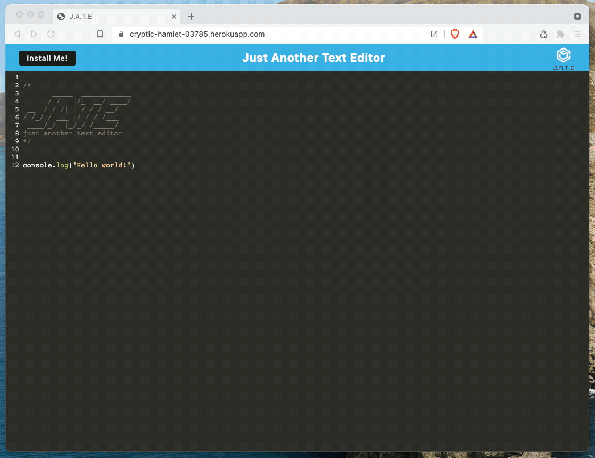
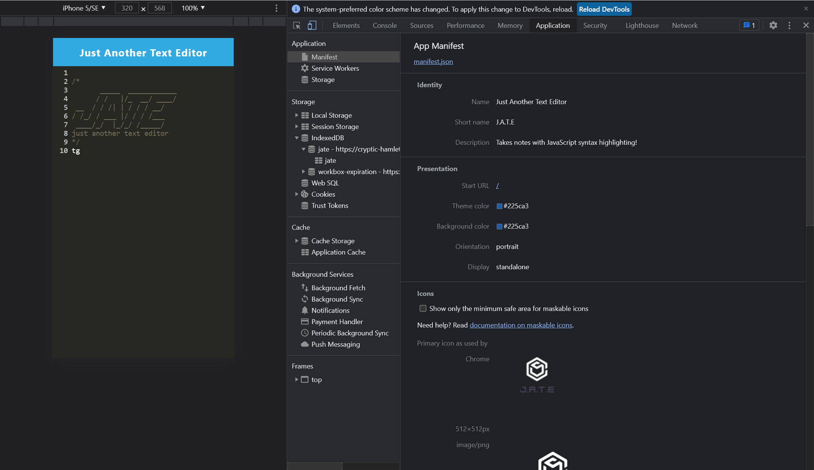
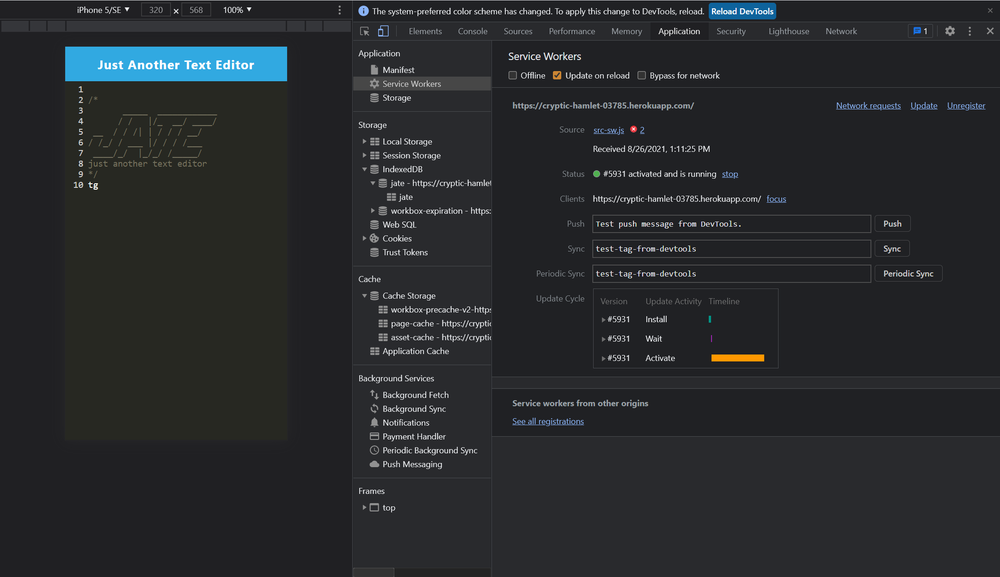
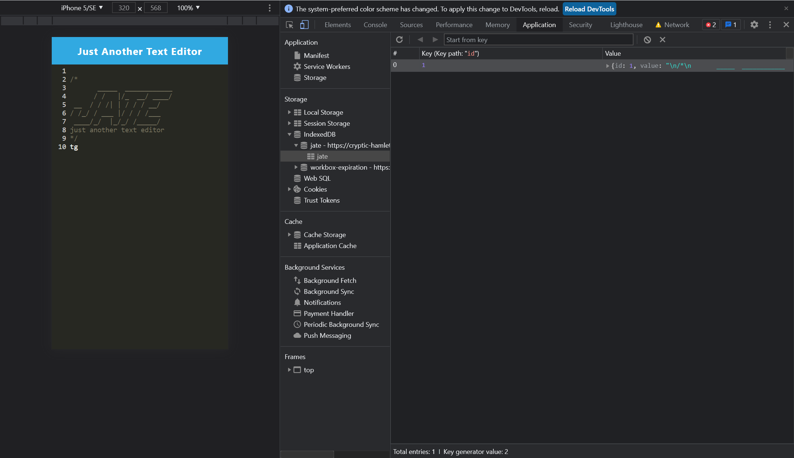

# Unit 19 PWA Homework: Text Editor (Modified Edition)

## Before anything else

You can use a clone of this repo for your homework submission, but do NOT include this README file in your submission! .The Assets folder in the repo root is for this README file only; you don't to submit it.

## Instructions

The web application from which the PWA will be created has already been built for you (and was intended to be). The main goal of this homework assignment is to properly set up and configure the web app so it can function as a PWA.

Make sure you post your final work to Heroku. You can use the [Heroku Deployment Guide on The Full-Stack Blog](https://coding-boot-camp.github.io/full-stack/heroku/heroku-deployment-guide) if needed. There is no database component. 

Don't forget to make sure your root package.json file is set up for Heroku.

You will be modifying the files listed below. These are the same files that would need to be modified in the original homework, I've just tried to make things a bit easier to understand. None of the server files need to be touched.

In each file you will see TODO items in the comments. I've tried to give some added texture to each item to help as well.

## Files To Edit

- client/src-sw.js
- client/webpack.config.js
- client/src/database.js
- client/src/install.js

## Things To Note

- There is a package.json file in the root, and also in both the server and client directories. This is intentional, as we want each environment to have its own dependencies.

- Take a look at the package.json file in the root of the project, and at the scripts object inside it. You will see some new things going on. First, there is an "install" script. When you run `npm install` from the command line, this script will make sure that both of the interior package.json files have their dependencies installed. You'll see this approach used later when we build full MERN apps.

- Notice also a script named "start:dev". It uses a node package called concurrently to start up both your server and client environments at the same time when you are in development. So to test locally, just run `npm start:dev`.

- When you want to test how this will work in production, run `npm start`. Notice that this script then runs a build script in the client environment. In the *client/package.json* file, you'll see that the build script invokes Webpack, and from there Webpack does its thing.

## How to Test

As you develop, you can run things using `npm start:dev`. When you think you have everything completed, then run `npm start`. This will initiate the build process. The app will then be running on port 3000. You'll see a button in the header of the app where you can install it as a PWA. Try it out!

Once everything works locally, deploy to Heroku and test again. You can even test on a mobile device if you want.

If you need to start from scratch and remove the existing PWA:

- Close the standalone browser window containing the PWA
- Delete the PWA from your hard drive 
- Kill the server session running in VS Code 
- In Chrome, go to localhost:3000, the app may or may not open again. If it does, open up the dev console, go to Application -> Service Workerss and click the **Unregister Worker** link.

Everything below comes from the curriculum README.

## Mock-Up

The following animation demonstrates the application functionality:

The following image shows the application's `manifest.json` file:

The following image shows the application's registered service worker:

The following image shows the application's IndexedDB storage:

## Review

You are required to submit the following for review:

* The URL of the deployed application

* The URL of the GitHub repository, with a unique name and a README describing the project

- - -
© 2022 Trilogy Education Services, LLC, a 2U, Inc. brand. Confidential and Proprietary. All Rights Reserved.
